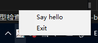

**This repository is forked from [Infinidat/infi.systray](https://github.com/Infinidat/infi.systray)**

# `infi.systray`

This module implements a Windows system tray icon with a right-click context menu.

## Installation
```shell
git clone https://github.com/yunline/infi.systray.git
cd infi.systray
pip install .
```

## Usage

```py
from infi.systray import SysTrayIcon

menu_options = (
    ("Say hello", None, lambda systray:print("hello")),
    ("Exit", None, SysTrayIcon.QUIT),
)

def on_quit(systray):
    print("quit")

cnt = 0
def on_double_click(systray):
    cnt+=1
    print(f"double click count: {cnt}")

systray = SysTrayIcon(
    "icon.ico", 
    "my_program", 
    menu_options,
    on_quit=on_quit,
    on_double_click=on_double_click
)
systray.start()

print("The SysTrayIcon is created")
```
This example script will create a tray icon with a menu like below.



Most of usages of this library are the same as the [upstream](https://github.com/Infinidat/infi.systray). You can find the detail of usages [here](https://github.com/Infinidat/infi.systray?tab=readme-ov-file#usage).

For usages that are different from the upstream, see **Changes**.

## Changes
1. No default 'Quit' option  
    Originally `infi.systray` would add a special 'Quit' option for quitting the systray thread. You could not remove the 'Quit' from the menu without any hacking.   
    Now the 'Quit' option is removed. You can still use it by adding options like `("Exit", None, SysTrayIcon.QUIT)` to your `menu_options`.
2. New callback `on_double_click`   
    Originally double-clicking the icon of the systray was equivalent to clicking the first option of the menu.  
    Now you can choose what to do when double-clicking, by setting the `on_double_click` argument
3. This fork uses `pyproject.toml`. Now you can directly use `pip install .` to install the library.
4. Now you can choose not to block the thread when using `shutdown` method. Just use `shutdown(join=False)`.

## Credit

This module is adapted from an implementation by Simon Brunning, which in turn was adapted from Mark Hammond's
win32gui_taskbar.py and win32gui_menu.py demos from PyWin32.

This module is modified by [yunline](https://github.com/yunline) at 2025.

